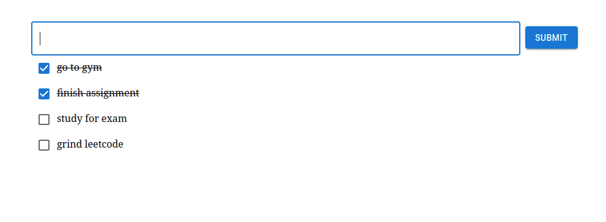

# React to-do List
A to-do list project to learn fundamentals of react framework. 

## Instructions to run
Run the following command in console

```sh
$ npm start
```

Runs the app in the development mode.\
Open [http://localhost:3000](http://localhost:3000) to view it in the browser.

The page will reload if you make edits.\
You will also see any lint errors in the console.

Use the submit button instead of hitting the enter key.

